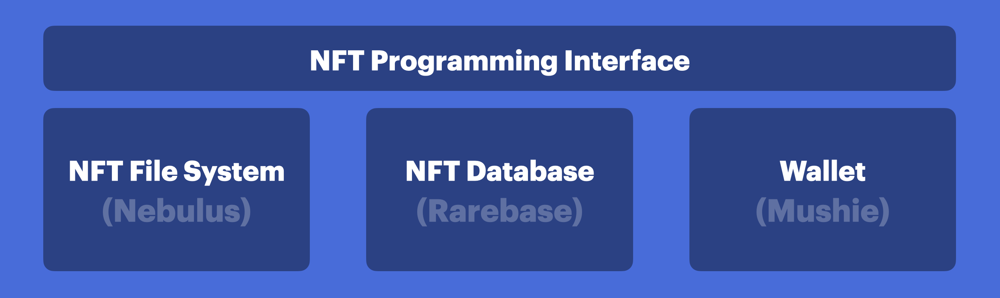
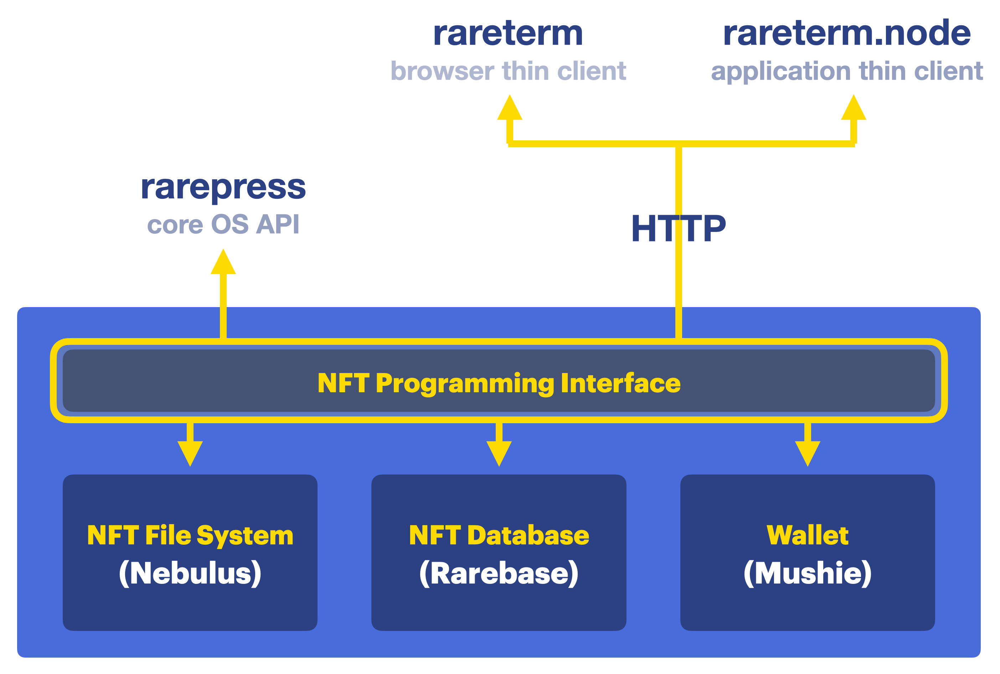

<header>
  <a href="https://rarepress.org">Home</a>
  <a href="https://twitter.com/skogard">Twitter</a>
  <a href="https://github.com/rarepress">GitHub</a>
  <a href="https://discord.gg/BZtp5F6QQM">Discord</a>
</header>

> Looking for the main documentation?: https://guide.rarepress.org
>
> Looking for Examples?: https://examples.rarepress.org


# API V1

## modules

The Rarepress API is made up of the top level core module and 3 top level modules:

1. [rarepress](#rarepress-1): The core engine
1. [rarepress.fs](#rarepressfs): File system
2. [rarepress.token](#rarepresstoken): Token database
3. [rarepress.trade](#rarepresstrade): Trade database

The API (NFT Programming Interface) interfaces with the underlying file system, database and the admin wallet.



## direct vs. networking


There are 3 different ways to use Rarepress:

- **Direct API**
    - `rarepress`: **The core rarepress operating system API.**
        - Directly read/write to local rarepress using JavaScript API.
        - No network connection required.
        - Completely autonomous, with no 3rd party depenedency.
- **Network API**
    - `rareterm`: **Browser thin client API.**
        - Read/Write to a remote rarepress (a `rarenet` server) over HTTP from the browser using JavaScript.
        - all data is stored on the remote rarepress instance (`rarenet`)
    - `rareterm.node`: **Application thin client API.**
        - Read/Write to a remote rarepress (a `rarenet` server) over HTTP from node.js
        - all data is stored on the remote rarepress instance (`rarenet`)

---



---

> NOTE
>
> The Rarepress stack has an isomorphic API system, which means all 3 approaches have the exact same APIs.
>
> The only different part is the initialization step.

# Initializing a rarepress session


## overview

The only difference between `rarepress`, `rareterm`, and `rareterm.node` usage is the **initialization step**.

- **Direct API**: `rarepress`
  - Stores tokens and assets in a local database and file system
  - Therefore the initialization step for `rarepress` involves **configuring database, file system etc.**
- **Network API**: `rareterm` and `rareterm.node`
  - Everything happens on a remote server (a `rarenet` node).
  - This means these APIs DO NOT store things locally, but instead reads from and writes to a REMOTE Rarepress (via Rarenet).
  - Therefore the initialization step involves **specifying the remote Rarepress host network URL**


## rarepress

### Introduction

`rarepress` is the core operating system that is completely self-contained and does not require any network connection and does not require any 3rd party API reliance.

### Install

First install rarepress using:

```
npm install rarepress
```

### Initialize

#### Syntax

You must first initialize a `rarepress` session before using it. It requires 2 steps:

1. **constructor:** Construct a rarepress object
2. **rarepress.init():** Initialize the rarepress object with configuration

```javascript
const Rarepress = require('rarepress')
const rarepress = new Rarepress()
await rarepress.init(config)
```

#### Parameters

`config` can have the following attributes:

- `db`: Database initialization config (internally Rarepress uses knex.js. The config is the config passwed to the [knex.js initialization step](https://knexjs.org/#Installation-client)
- `fs`: File system initialization config
  - `path`: Root path for the file system
  - `max`: Max supported file size
  - `config`: IPFS bootstrap configuration (useful when you want to run multiple IPFS nodes from multiple ports from the same machine
- `network`: `"mainnet"|"rinkeby"|"ropsten"` (default: "mainnet")


#### How it works

Once you initialize, the rarepress object is instantiated with:

- `rarepress.fs`: The file system API
- `rarepress.token`: The token database API
- `rarepress.trade`: The trade database API
- `rarepress.wallet`: Wallet API
  - `rarepress.wallet.address`: The signed in address (string)


### Examples

#### Basic Example

By default rarepress uses `sqlite3` as backend and stores files under the `fs` folder. 

So to get started quickly you can simply try the most basic example that creates tokens for the `rinkeby` network:

```javascript
await rarepress.init({
  network: "rinkeby",
})
```

#### Advanced SQLite3 Example

You can also set additional configs like this:

```javascript
await rarepress.init({
  network: "rinkeby",
  fs: {
    path: "fs",
    max: 100,
  },
  db: {
    client: "sqlite3",
    connection: {
      filename: "fs/rarebase.sqlite3"
    }
  }
})
```

#### Advanced Postgresql Example

You can use Postgresql as database

```javascript
await rarepress.init({
  network: "rinkeby",
  fs: {
    path: "fs",
    max: 100,
  },
  db: {
    client: "postgresql",
    connection: {
      ssl: {
        rejectUnauthorized: false
      },
      host: "127.0.0.1",
      port: 25060,
      user: "admin",
      password: "password",
      database: "rarebase"
    },
    pool: {
      min: 2,
      max: 10
    }
  }
})
```

## rareterm

### Introduction

`rareterm` is a JavaScript library that implements a browser thin client for communicating with a [remote rarepress server (rarenet)](https://guide.rarepress.org/#/?id=rarenet).

Unlike `rarepress` which stores everything on the local machine, `rareterm` stores everything on a remote host.

### Install

Rareterm works in the browser. You can import it in 2 ways:

1. Import from `<script>` tag
2. Import from JavaScript frameworks (React, Vue, etc.)

#### Import from script tag

All you need to do is include a `<script>` tag:

```
<script src="https://unpkg.com/rareterm"></script>
```

#### Import from JavaScript frameworks

To import from JS frameworks like React, Vue, etc., first install the module:

```
npm install rareterm
```

or

```
yarn add rareterm
```

> NOTE
>
> When using in the browser, make sure to use "rareterm", not "rareterm.node".
>
> - rareterm is for browser usage, which uses browser wallets like MetaMask
> - rarerterm.node is for node.js, with a built-in wallet that automatically signs messages

### Initialize

#### Syntax

When using in the browser, you can directly use the global `Rareterm` variable:

```javascript
const rarepress = new Rareterm()
await rarepress.init(config)
```

When importing from JS frameworks, you need to first require or import the module:

```javascript
const Rareterm = require('rareterm')
const rarepress = new Rareterm()
await rarepress.init(config)
```


#### Parameters

The `config` can have the following attributes:

- `host`: The `rarenet` endpoint URL

### Example

Then you can import with a `require` like this:

```javascript
/**************************************************************
*
* The following code assumes:
* 1. it's being executed in the browser context
* 2. the browser has Metamask installed
*
**************************************************************/
const Rareterm = require('rareterm')
// Instantiate a rarepress session by creating a Rareterm object
const rarepress = new Rareterm();
rarepress.init({ host: "https://rinkeby.rarenet.app/v1" }).then((address) => {
  rarepress.fs.add( . . . )
})
```

Or using the `import` syntax:

```javascript
/**************************************************************
*
* The following code assumes:
* 1. it's being executed in the browser context
* 2. the browser has Metamask installed
*
**************************************************************/
import Rareterm from "rareterm"
// Instantiate a rarepress session by creating a Rareterm object
const rarepress = new Rareterm();
rarepress.init({ host: "https://rinkeby.rarenet.app/v1" }).then((address) => {
  rarepress.fs.add( . . . )
})
```

## rareterm.node

### Introduction

`rareterm.node` is internally powered by `rareterm`, but instead of running in the browser, it's designed to work in node.js environment, which means you can embed it into an application.

Just to clarify how these are different from one another, here's the comparison:

- `rareterm.node` vs `rareterm`
  - `rareterm` is a browser thin client. `rareterm.node` is a node.js thin client.
  - `rareterm.node` is different from `rareterm` in that it uses its own built-in wallet, and is designed to work on your own machine instead of inside a browser.
  - Since it has a built-in wallet, it can be used to automatically mint thousands of NFTs WITHOUT asking for user wallet approvals thousands of times.
- `rareterm.node` vs `rarepress`
  - `rarepress` is a self-contained system that does not require network connection. It stores everything on its local database and file system.
  - `rareterm.node` is a thin client that connects to a remote `rarepress` ([rarenet](https://guide.rarepress.org/#/?id=rarenet)) by connecting to a `rarenet` endpoint ([You can run your own rarenet](https://guide.rarepress.org/#/?id=install-rarenet)).


### Install

To install `rareterm.node` on your machine, run:

```
npm install rareterm.node
```


### Initialize

#### Syntax

```javascript
const Rareterm = require('rareterm.node')
const rarepress = new Rareterm()
await rarepress.init(config)
```

#### Parameters

The `config` can have the following attributes:

- `host`: The `rarenet` endpoint URL
- `key`: BIP44 derivation path (optional. by default it's m'/44'/60'/0'/0/0)

### Example

```javascript
/***********************************************************************
*
* The following code assumes:
* 1. it's being executed on your machine via node.js program execution
*
***********************************************************************/
const Rareterm = require('rareterm.node')
const rarepress = new Rareterm()
rarepress.init({
  host: "https://rinkeby.rarenet.app/v1"
}).then((address) => {
  rarepress.fs.add( . . . )
})
```

or,

```javascript
/***********************************************************************
*
* The following code assumes:
* 1. it's being executed on your machine via node.js program execution
*
***********************************************************************/
import Rareterm from "rareterm.node"
// Instantiate a rarepress session by creating a Rareterm object
const rarepress = new Rareterm();
rarepress.init({
  host: "https://rinkeby.rarenet.app/v1"
}).then((address) => {
  rarepress.fs.add( . . . )
})
```

### Custom Key Path

You can generate as many keys as you want:

```javascript
/***********************************************************************
*
* The following code assumes:
* 1. it's being executed on your machine via node.js program execution
*
***********************************************************************/
const Rareterm = require('rareterm.node')
const rarepress = new Rareterm()
rarepress.init({
  host: "https://rinkeby.rarenet.app/v1",
  key: "m'/44'/60'/0'/0/1"
}).then((address) => {
  rarepress.fs.add( . . . )
})
```

# API Reference

## rarepress

### constructor

For `rarepress` package:

```javascript
const rarepress = new Rarepress()
```
See ["initializing rarepress" section](#rarepress) for more.

For `rareterm` and `rareterm.node` package:

```javascript
conost rarepress = new Rareterm()
```

See ["initializing rareterm" section](#rareterm) or ["initializing rareterm.node" section](#raretermnode) for more.

### rarepress.init()

Initialize a rarepress session.

- `rarepress`: See ["initializing rarepress" section](#rarepress)
- `rareterm`: See ["initializing rareterm" section](#rareterm)
- `rareterm.node`: See ["initializing rareterm.node" section](#raretermnode)

### rarepress.login()

Log into an account.

> **NOTE**
>
> When you call `rarepress.init()`, it automatically logs you into the default Ethereum account at `m'/44'/60'/0'/0/0`, so you don't need to call a separate `login()` method.
>
> the `login()` method is useful when you want to switch accounts (for example signing tokens and trades with multiple addresses)

#### Syntax

```javascript
const account = await rarepress.login(bip44_derivation_path)
```

#### Parameters

- `bip44_derivation_path`: The [bip44 key derivation path](https://github.com/bitcoin/bips/blob/master/bip-0044.mediawiki) for the account to log into (example: "m'/44'/60'/0'/0/1")

#### Return Value

- `account`: returns the address of the new logged in account.

#### Example

Here's an example where:

1. You mint 10 tokens
2. You use a different address for each token

```javascript
const Rarepress = require('rarepress')
const rarepress = new Rarepress();
(async () => {
  // initialize the session
  await rarepress.init({ network: "mainnet" });

  // create 10 tokens from 10 different accounts
  for(let i=0; i<10; i+) {
    // add a web file to rarepress fs
    const generative_image = `https://avatars.dicebear.com/api/micah/${i}.svg`
    const key_path = `m'/44'/60'/0'/0/${i}`
    let cid = await rarepress.fs.add(generative_image)

    // log into a new account
    await rarepress.login(key_path)

    // create a token with the new account
    let token = await rarepress.token.create({
      metadata: {
        name: "User " + i,
        description: "User #" + i,
        image: "/ipfs/" + cid
      }
    })

    // publish the image file to IPFS
    await rarepress.fs.push(cid)
    // publish the metadata file to IPFS
    await rarepress.fs.push(token.tokenURI)

    // publish the token to marketplace
    await rarepress.token.send(token)
  }

  process.exit()
})();
```

### rarepress.account

The `rarepress.account` attribute stores the currently logged in account's address (string)

```javascript
const Rarepress = require('rarepress')
const rarepress = new Rarepress();
(async () => {
  await rarepress.init({ network: "mainnet" });
  console.log(rarepress.account)
})();
```

## rarepress.fs

### rarepress.fs.add()

#### Syntax

```javascript
const cid = await rarepress.fs.add(<item>)
```


#### Parameters

The `<item>` can be:

1. **ArrayBuffer:** Add [arraybuffer](https://developer.mozilla.org/en-US/docs/Web/JavaScript/Reference/Global_Objects/ArrayBuffer) to IPFS and get the IPFS hash (CID) back.
2. **Blob:** Add a [Blob](https://developer.mozilla.org/en-US/docs/Web/API/Blob) to IPFS and get the IPFS hash (CID) back.
3. **File:** Add a [File](https://developer.mozilla.org/en-US/docs/Web/API/File) to IPFS and get the IPFS hash (CID) back.
4. **URL:** Download the file from the URL and add to IPFS file, and return the CID.

#### Return Value

returns a [promise](https://developer.mozilla.org/en-US/docs/Web/JavaScript/Reference/Global_Objects/Promise) which resolves to the [IPFS hash (CID)](https://docs.ipfs.io/concepts/content-addressing/) of the data you've added.

#### How it works

Once you call `rarepress.fs.add()` and it successfully returns a cid, the file you add is instantly accessible over HTTP at:

```
<RARENET_HOST>/ipfs/<CID>
```

Using the public Rarenet node example:

1. `https://eth.rareenet.app/ipfs/<cid>` if you are using the mainnet rarenet node
2. `https://rinkeby.rarenet.app/ipfs/<cid>` if you are using the rinkeby rarenet node
3. `https://ropsten.rarenet.app/ipfs/<cid>` if you are using the ropsten rarenet node

It is important to understand that these files are treated as ephemeral (hence the name ephemeral IPFS). They are meant to be accessible at those URLs only until you mint them as NFTs.

Once you mint them into NFTs, they are finally published to IPFS, and therefore will be accessible at `https://ipfs.io/ipfs/<cid>` gateway as well as other ways.

Why would this be helpful? There are many use cases but one obvious one is: You may want to use them to display previews before you mint, depending on what kind of NFT application you're building.

Just like how the NFT Lazy minting approach doesn't put transactions on the blockchain until the first sale is made, Ephemeral IPFS doesn't put files on IPFS until it needs to be published.

To publish the files to the public IPFS network, you can call [rarepress.fs.push()](#rarepressfspush).

### rarepress.fs.push()

Publish the local private IPFS files on the Rarepress file system to the public IPFS network.

#### Syntax

```javascript
const cid = await rarepress.push(CID)
```

#### Parameters

- `CID`: can be either:
  - `<IPFS_CID>`
  - `/ipfs/<IPFS_CID>`

#### Return Value

Returns the pushed `CID` when the file is successfully published and is discovered on a public IPFS gateway.

Here's an example:

```javascript
let cid = await rarepress.fs.add("https://avatars.dicebear.com/api/male/john.svg")
let token = await rarepress.token.create({
  metadata: {
    name: "test",
    description: "testing",
    image: "/ipfs/" + cid
  }
})
// push the image file
await rarepress.fs.push(cid)
// push the metadata file
await rarepress.fs.push(token.tokenURI)
```

### rarepress.fs.folder()

Create an IPFS folder from a collection of IPFS files

#### Syntax

```javascript
const cid = await rarepress.folder(<folder mapping>)
```

The `<folder mapping>` is a mapping between file names and their corresponding IPFS CIDs.

> NOTE
>
> For the sake of simplicity, a folder can only contain files, and cannot contain child folders.

#### Parameters

The `<folder mapping>` is a key/value object made up of filenames and their corresponding IPFS CIDs. Here's what it looks like:

```javascript
const cid = await rarepress.folder({
  <filename1>: <IPFS CID1>,
  <filename2>: <IPFS CID2>,
  <filename3>: <IPFS CID3>
})
```

To create a folder you need an existing set of IPFS CIDs to put in your folder. You may achieve this by adding files to IPFS using `rarepress.fs.add()`.

Here's a quick example:

```javascript
// 1. Add files to rarepress and create a mapping between filenames and the IPFS hash returned by rarepress.fs.add()
let cid0 = await rarepress.fs.add("https://raw.githubusercontent.com/skogard/aperank/main/public/aperank.png")
let cid1 = await rarepress.fs.add("https://raw.githubusercontent.com/skogard/aperank/main/README.md")
let cid2 = await rarepress.fs.add('https://raw.githubusercontent.com/skogard/aperank/main/index.js')
let cid3 = await rarepress.fs.add("https://raw.githubusercontent.com/skogard/aperank/main/package.json")
let mapping = {
  "aperank.png": cid0,
  "readme.md": cid1,
  "index.js": cid2,
  "package.json": cid3
}
// 2. Create a folder by passing the mapping to rarepress.folder()
let folder_cid = await rarepress.folder(mapping)
```

You can also do abbreviate the whole thing into a single line, so that files are added and then the folder is created from the files in a single line:

```javascript
let folder_cid = await rarepress.folder({
  "aperank.png": await rarepress.fs.add("https://raw.githubusercontent.com/skogard/aperank/main/public/aperank.png"),
  "readme.md": await rarepress.fs.add("https://raw.githubusercontent.com/skogard/aperank/main/README.md"),
  "index.js": await rarepress.fs.add('https://raw.githubusercontent.com/skogard/aperank/main/index.js'),
  "package.json": await rarepress.fs.add("https://raw.githubusercontent.com/skogard/aperank/main/package.json")
})
```

#### Return Value

returns a [promise](https://developer.mozilla.org/en-US/docs/Web/JavaScript/Reference/Global_Objects/Promise) which resolves to the [IPFS hash (CID)](https://docs.ipfs.io/concepts/content-addressing/) of the resulting folder.

You can use the folder CID when creating your NFT by constructing the file paths using the folder CID. Example:

```javascript
let folder_cid = await rarepress.folder({
  "aperank.png": await rarepress.fs.add("https://raw.githubusercontent.com/skogard/aperank/main/public/aperank.png"),
  "readme.md": await rarepress.fs.add("https://raw.githubusercontent.com/skogard/aperank/main/README.md"),
  "index.js": await rarepress.fs.add('https://raw.githubusercontent.com/skogard/aperank/main/index.js'),
  "package.json": await rarepress.fs.add("https://raw.githubusercontent.com/skogard/aperank/main/package.json")
})
let token = await rarepress.create({
  metadata: {
    name: "aperank",
    description: "Rank Bored Apes by rare factor, powered by Apebase.",
    image: "/ipfs/" + folder_cid + "/aperank.png",
    attributes: [{
      trait_type: "readme.md",
      value: "/ipfs/" + folder_cid + "/readme.md"
    }, {
      trait_type: "index.js",
      value: "/ipfs/" + folder_cid + "/index.js"
    }, {
      trait_type: "package.json",
      value: "/ipfs/" + folder_cid + "/package.json"
    }]
  }
})
```


## rarepress.token

### rarepress.token.build()

#### Syntax

```javascript
await rarepress.token.build(DSL)
```

#### Attributes

The `DSL` parameter can have the following attributes:

- `type`: `"ERC721"` or `"ERC1155"`
- `metadata` (optional)
  - `name`
  - `description`
  - `image`
  - `attributes` (optional): An array of objects made up of the following attributes:
    - `trait_type`: trait name
    - `value`: trait value
  - note that above attributes are simply the standards. Developers can attach arbitrary objects to the metadata.
- `contract` (optional): By default auto-determined by the `type` attribute. You can specify this attribute when trying to integrate with a custom contract.
- `creators` (optional): An array of objects made up of the following attributes:
  - `account`: creator's ethereum address
  - `value`: the weight (out of 10,000) each creator partakes. (ex: 1000 if 10%)
- `royalties` (optional): An array of objects made up of the following attributes:
  - `account`: a royalty beneficiary's ethereum address
  - `value`: the weight (out of 10,000) each royalty beneficiary is entitled to. (ex: 1000 if 10%)
- `supply` (optional): Total supply of tokens issued. Only used when `type` is `"ERC1155"` (fungible)

Example:

```javascript
let token = await rarepress.token.build({
  contract: <contract address (optional)>,
  type: <"ERC721"|"ERC1155">,
  metadata: {
    name: <token name>,
    description: <token description>,
    image: <token image ipfs URI>,
  },
  creators: <creators array>,
  royalties: <royalties array>
})
```

#### Return value

The `rarepress.token.build()` method returns a generated token in a JSON structure:

```json
{
  metadata: {
    name: '🍞',
    description: 'bread',
    image: '/ipfs/bafkreicfr4bz67h7lm7qtyzcq42mlyar2satkdgno2q6uimjyjco5euxt4',
    cid: 'bafkreifrc6qaqyukk7lbpzlbtignhslyjwyctlm6zvtwnu5qvticsfm7se'
  },
  creators: [ [Object], [Object], [Object] ],
  supply: 100,
  royalties: [],
  tokenId: '52103307166765014994970427877263908096137622415890451140465293884076288340311',
  tokenURI: '/ipfs/bafkreifrc6qaqyukk7lbpzlbtignhslyjwyctlm6zvtwnu5qvticsfm7se',
  uri: '/ipfs/bafkreifrc6qaqyukk7lbpzlbtignhslyjwyctlm6zvtwnu5qvticsfm7se',
  '@type': 'ERC1155',
  contract: '0x1AF7A7555263F275433c6Bb0b8FdCD231F89B1D7'
}
```

### rarepress.token.sign()

#### Syntax

```javascript
await rarepress.token.sign(token)
```

#### Attributes

The `sign()` method takes a token (signed or unsigned), signs it, and returns a new token with the signature attached under `signatures` arrray.

1. **Signing an unsigned token:** Automatically determines the currently logged in wallet's account, signs the unsigned token, and places the signatures in the corresponding position in the `signatures` array.
2. **Signing a signed token:** Automatically determines the currently logged in wallet's account, signs the existing signed token with the current user's keys, and merges the signature into the `signatures` array.

#### Return value

Here's an example where the first creator in the `creators` array signs the token:

```json
{
  metadata: {
    name: '🍞',
    description: 'bread',
    image: '/ipfs/bafkreicfr4bz67h7lm7qtyzcq42mlyar2satkdgno2q6uimjyjco5euxt4',
    cid: 'bafkreifrc6qaqyukk7lbpzlbtignhslyjwyctlm6zvtwnu5qvticsfm7se'
  },
  creators: [ [Object], [Object], [Object] ],
  supply: 100,
  royalties: [],
  tokenId: '52103307166765014994970427877263908096137622415890451140465293884076288340311',
  tokenURI: '/ipfs/bafkreifrc6qaqyukk7lbpzlbtignhslyjwyctlm6zvtwnu5qvticsfm7se',
  uri: '/ipfs/bafkreifrc6qaqyukk7lbpzlbtignhslyjwyctlm6zvtwnu5qvticsfm7se',
  '@type': 'ERC1155',
  contract: '0x1AF7A7555263F275433c6Bb0b8FdCD231F89B1D7',
  signatures: [
    <sig1>, null, null
  ]
}
```

#### Multisig Tokens

Rarepress makes it easy to incorporate multiple wallet signatures into a token.

If the incoming token is already signed, the sign method merges the current signature into the signatures array. (Note the `signatures` array only has one `<sig1>` item and the rest are `null` values):

```javascript
let doubleSignedToken = await rarepress.token.sign({
  metadata: {
    name: '🍞',
    description: 'bread',
    image: '/ipfs/bafkreicfr4bz67h7lm7qtyzcq42mlyar2satkdgno2q6uimjyjco5euxt4',
    cid: 'bafkreifrc6qaqyukk7lbpzlbtignhslyjwyctlm6zvtwnu5qvticsfm7se'
  },
  creators: [ [Object], [Object], [Object] ],
  supply: 100,
  royalties: [],
  tokenId: '52103307166765014994970427877263908096137622415890451140465293884076288340311',
  tokenURI: '/ipfs/bafkreifrc6qaqyukk7lbpzlbtignhslyjwyctlm6zvtwnu5qvticsfm7se',
  uri: '/ipfs/bafkreifrc6qaqyukk7lbpzlbtignhslyjwyctlm6zvtwnu5qvticsfm7se',
  '@type': 'ERC1155',
  contract: '0x1AF7A7555263F275433c6Bb0b8FdCD231F89B1D7',
  signatures: [
    <sig1>, null, null
  ]
}
```

Let's assume the current wallet is the second user in the `creators` array.

In this case, `rarepress.token.sign()` signs the token with the second creator's key, and merges the signature `<sig2>` into the `signatures` array, like this (note the `signatures` array now contains 2 items `<sig1>` and `<sig2>`):

```json
{
  metadata: {
    name: '🍞',
    description: 'bread',
    image: '/ipfs/bafkreicfr4bz67h7lm7qtyzcq42mlyar2satkdgno2q6uimjyjco5euxt4',
    cid: 'bafkreifrc6qaqyukk7lbpzlbtignhslyjwyctlm6zvtwnu5qvticsfm7se'
  },
  creators: [ [Object], [Object], [Object] ],
  supply: 100,
  royalties: [],
  tokenId: '52103307166765014994970427877263908096137622415890451140465293884076288340311',
  tokenURI: '/ipfs/bafkreifrc6qaqyukk7lbpzlbtignhslyjwyctlm6zvtwnu5qvticsfm7se',
  uri: '/ipfs/bafkreifrc6qaqyukk7lbpzlbtignhslyjwyctlm6zvtwnu5qvticsfm7se',
  '@type': 'ERC1155',
  contract: '0x1AF7A7555263F275433c6Bb0b8FdCD231F89B1D7',
  signatures: [
    <sig1>, <sig2>, null
  ]
}
```

### rarepress.token.save()

Saves a token to the DB.

#### Syntax

```javascript
await rarepress.token.save(signedToken)
```

#### Attributes

- `signedToken`: a token with at least one signature in the `signatures` array.

> NOTE
>
> 1. A token must be saved before a trade object can be created.
> 2. save method requires the signatures array to be not empty.

#### Return value

Returns the saved token `signedToken` when successful.

When failed, throws an error.


### rarepress.token.create()

The `await rarepress.token.create()` method executes all of the following methods in sequence, with one line of code:

1. `rarepress.token.build()`: build a token
2. `rarepress.token.sign()`: sign the token
3. `rarepress.token.save()`: save the token to rarepress

#### Syntax

```javascript
let signedToken = await rarepress.token.create(DSL);
```

#### Attributes

- `DSL`: The same configuration used in `rarepress.token.build()`.

#### Return values

Builds, signs, and saves the token on Rarepress, and returns the final signed token.

### rarepress.token.send()

Send a token to a remote endpoint. Some example scenarios:

1. **Post to a Marketplace:** Post to Rarible.com (default)
2. **Peer to Peer Communication:** Post the token to any specified endpoint.
  - A peer may be a Rarepresso (Rarepress HTTP server) instance.
  - A peer may be a custom web server.

#### Syntax

```javascript
let response = await rarepress.token.send(token);
let response = await rarepress.token.send(token, url);
```

#### Attributes

- `token`: a full token object to send to a remote endpoint
- `url` (optional): the destination endpoint URL to post to. If not specified, the tokens are posted to Rarible.com's API endpoint.

#### Return values

Returns the HTTP response returned from the remote endpoint

> NOTE
>
> rarepress.token.send() DOES NOT automatically save tokens in Rarepress.
> If you want to keep track of all your tokens, you must:
>
> 1. Save your token using rarepress.token.save(), or
> 2. Create a token using rarepress.token.create(), automatically saves the token to Rarepress.


#### Create vs. Send

Note that `rarepress.token.create()` only "creates" and saves it on Rarepress.

At this point, the token is considered already minted (even before sending it to any marketplace), and you can pass it around across multiple communication channels, since all tokens are cryptographically signed.

However, to actually list it on a marketplace like Rarible.com, you must send it to the marketplace using `rarepress.token.send()`.

```javascript
// 1. creates a signed token and stores it to rarepress
let signedToken = await rarepress.token.create({
  contract: <contract address (optional)>,
  type: <"ERC721"|"ERC1155">,
  metadata: {
    name: <token name>,
    description: <token description>,
    image: <token image ipfs URI>,
  },
  creators: <creators array>,
  royalties: <royalties array>
})
// 2. send the created token to Rarible
await rarepress.token.send(signedToken.tokenId)
```


### rarepress.token.query()

Query the relational database that powers Rarepress. The database schema is explained her

```javascript
let tokens = await rarepress.token.query({
  where: { creator: address }
})
```

The response is an array made up of `token` rows in the [tokens database](#token-database)

### rarepress.token.queryOne()

Convenience method for `token.query`. Instead of returning a whole array of matching items, `token.queryOne()` only returns the first matching result object.

```javascript
let token = await rarepress.token.queryOne({
  where: { tokenId: tokenId }
})
```

The response is a matching `token` row in the [tokens database](#token-database)

### rarepress.token.files()

Retrieve all the IPFS CIDs associated with a token object.

#### Syntax

```javascript
let files = await rarepress.token.create(token);
```

#### Attributes

- `token`: A [token object](https://guide.rarepress.org/#/?id=token).

All of the following methods return a `token` object:

- `rarepress.token.build()`
- `rarepress.token.sign()`
- `rarepress.token.create()`

which means you can pass the response from any of the above methods into the `rarepress.token.files(token)` method to get all the files included in the token's metadata.

#### Return values

An array of Rarepress files with the following attributes:

- `cid`: The IPFS CID extracted from the token object
- `path`: The key path at which the IPFS CID was found

Example:

```javascript
files := [{
  cid: <metadata cid>,
  path: []
}, {
  cid: <image cid>,
  path: ["image"]
}]
```

This method traverses the token object to find all instances of `/ipfs/<cid>` strings, and returns them all as an array.

Let's take an example token metadata:

```json
{
  "name": "test",
  "description": "test description",
  "image": "bafybeicwcpbar5xdj75ri6tu3j5a5bhhxw7askd4qgmdnrzoyojhwzf5a4",
  "attributes": [{
    "trait_type": "temperature",
    "value": 100
  }, {
    "trait_type": "video",
    "value": "bafkreif24ji5psjxe6dt3gbej54z2q2fgkirh3yqokyfd5bhmkn5ijivza"
  }]
}
```

Let's assume that the IPFS CID of the above metadata itself is `bafybeicaivkonz2sofegu2thshbeod3723ye2i5c5ivsyhv7gyuyunyyoq`.

Now when we call `rarepress.token.files(token)` on a token with the above metadata, we will get the following `files` array response:

```json
[{
  cid: "bafybeicaivkonz2sofegu2thshbeod3723ye2i5c5ivsyhv7gyuyunyyoq",
  path: []
}, {
  cid: "bafybeicwcpbar5xdj75ri6tu3j5a5bhhxw7askd4qgmdnrzoyojhwzf5a4",
  path: ["image"]
}, {
  cid: "bafkreif24ji5psjxe6dt3gbej54z2q2fgkirh3yqokyfd5bhmkn5ijivza",
  path: ["attributes", 1, "value"]
}]
```

1. The first item is the metadata file itself. Since it's describing the metadata itself, there is no path, therefore an empty `path` array is returned.
2. Then the second item is the image file. The `image` attribute's path is `["image"]`.
3. The third item is the "video" trait inside the `attributes` array. The path is `["attributes", 1, "value"]`.

#### Usage

This method can be useful right before the token publish step, where you need to publish all the associated files to the public IPFS network before publishing the token.

1. Publish files to IPFS
2. Publish token to a marketplace

Here's a typical workflow for creating and publishing a token:

```javascript
// 1. create a token
let token = await rarepress.token.create( ... )
// 2. extract all the cids
let cids = await rarepress.token.files(token)
// 3. publish all the files to IPFS before publishing the token
await Promise.all(cids.map((cid) => {
  return rarepress.fs.push(cid)
})
// 4. publish the token to the marketplace
await rarepress.token.send(token)
```


## rarepress.trade

The trade API deals with creating, sending, and reading trade positions on tokens.

### rarepress.trade.build()

#### Syntax

```javascript
let trade = await rarepress.trade.create(<trade condition>)
```

#### Parameters

The [Rarible contract](https://rarible.org) provides very flexible ways to declare trade positions.

Rarepress has implemented an intuitive abstraction called `trade` that maps to all the attributes of the Rarible decentralized marketplace contract, so developers can easily understand and build declarative trade positions and send to the marketplace.

To create a `trade`, you pass the `<trade condition>` JavaScript object to the `rarepress.trade.create()` function. The `<trade condition>` is made up ofthe following attributes:

- `what`: What asset will I trade? **(required)**
  - `type`: `"ERC721"` or `"ERC1155"` **(required)**
  - `id`: tokenID **(required)**
  - `contract`: Contract ID (Only if it's ERC20 token. For example, for $RARI it's "0xfca59cd816ab1ead66534d82bc21e7515ce441cf")
  - `value`: The number of tokens you want to trade (Only if it's countable, such as ERC20, ERC1155, and ETH)
- `with`: What asset do I want to trade WITH? **(required)**
  - `type`: `"ERC721"` or `"ERC1155"` **(required)**
  - `id`: tokenID **(required)**
  - `contract`: Contract ID (Only if it's ERC20 token. For example, for $RARI it's "0xfca59cd816ab1ead66534d82bc21e7515ce441cf")
  - `value`: The number of tokens you want to trade (Only if it's countable, such as ERC20, ERC1155, and ETH)
- `who`: WHO is this trade intended for?
  - `from`: The Ethereum address of the person who's making this offer. If left out, it's automatically set as whoever is signing the trade.
  - `to`: The Ethereum address of the person who this offer is intended for. If not used, anyone can take the offer as long as they can match the condition.
- `when`: When shall this trade offer be considered valid? If left out, the trade offer is immediately effective without a deadline.
  - `from`: when does the trade offer start being valid?
  - `to`: when does the trade offer stop being valid?
- `how`: How shall the trade be executed?
  - `originFees`: Describe a one time fee that gets charged ONLY the first time a sales is made.
  - `payouts`: Describe who will be paid in what proportion.


#### Return Value

Trade object

### rarepress.trade.sign()

#### Syntax

```javascript
let signedTrade = await rarepress.trade.sign(unsignedTrade)
```

#### Parameters

- `unsignedTrade`: A trade object without a `signature` value.

#### Return values

- `signedTrade`: A trade object with the `signature` field filled in, based on the current wallet's signature of the trade.

### rarepress.trade.save()

#### Syntax

```javascript
let savedTrade = await rarepress.trade.save(signedTrade)
```

#### Parameters

- `signedTrade`: A signed trade object (You can only save signed trade objects to Rarepress)

##### Return values

- `savedTrade`: The saved trade object. Same as the `signedTrade` when it was saved successfully.

### rarepress.trade.create()

The one-liner method that runs all of the following methods in a single call:

1. `rarepress.trade.build()`: build a new unsigned trade object
2. `rarepress.trade.sign()`: sign the unsigned trade object
3. `rarepress.trade.save()`: save the signed trade object

### rarepress.trade.send()

#### Syntax

```javascript
let response = await rarepress.trade.send(trade)
let resopnse = await rarepress.trade.send(trade, url)
```

#### Parameters

- `trade`: Trade object
- `url` (optional): An endpoint to POST trade objects to. If not specified, the trade is automatically posted to the Rarible.com endpoint.

### rarepress.trade.query()

#### Syntax

```javascript
let results = await rarepress.trade.query(query)
```


#### Parameters

- `query`: Rarepress Query Language

#### Return values

- `results`: An array of items queried with the query language

The response is an array of rows in the [trades database](#trade-database)

### rarepress.trade.queryOne()

#### Syntax

```javascript
let result = await rarepress.trade.queryOne(query)
```

#### Parameters

- `query`: Rarepress Query Language

#### Return values

- `result`: A single object returned by querying the database with the query language

The response is a matching row in the [trades database](#trade-database)

---

# Rarepress Query Language

## Isomorphic API

Rarepress is powered by Rarebase, an NFT database for storing and querying token and trade objects, backed by relational databases such as SQLITE3 or Postgresql (Powered by [knex.js](https://knexjs.org/). 

The Rarepress Query Language can be used for all APIs in the Rarepress stack:

1. **Rarepress OS API:** Query a local Rarepress OS
2. **Rareterm Browser API:** Query a remote rarepress over HTTP in the browser
3. **Rareterm Node.js API:** Query a remote rarepress over HTTP in node.js

In order to provide an isomorphic API for querying the database both locally (using JavaScript) and remotely (over HTTP), Rarebase provides a query interface that can translate to a SQL query.


## Specification

The query language fits into a JSON:

```
{
  select: [<col>, <col>, .. ],
  from: tokens|trades,
  join: [args],
  where: [args],
  order: <orderBy>,
  limit: <limit>,
  offset: <offset>
}
```

The JSON gets translated into a [knex.js](https://knexjs.org/) query, which then gets translated to an SQL query statement. For example,

```json
{
  "select": ["tokenId"],
  "from": "tokens",
  "where": ["created_at", "<", 1629617382843],
  "limit": 10,
  "order": ["created_at", "desc"]
}
```

Translates to:

```
SELECT tokenId
FROM tokens
WHERE created_at < 1629617382843
LIMIT 10
ORDER BY created_at desc;
```

## Usage

Making a `query()` request will return an array of results:

```javascript
let items = await rarepress.query.query({
  "select": ["tokenId"],
  "from": "tokens",
  "where": ["created_at", "<", 1629617382843],
  "limit": 10,
  "order": ["created_at", "desc"]
})
console.log("items", items)
```

Making a `queryOne()` request will return a single result, or `null` if there is no match:

```javascript
let item = await rarepress.query.queryOne({
  "select": ["tokenId"],
  "from": "tokens",
  "where": ["created_at", "<", 1629617382843],
  "order": ["created_at", "desc"]
})
console.log("item", item)
```

## Database Schema

Currently Rarebase has the following schema:

```javascript
exports.up = function(knex) {
  return knex.schema
  .createTable('tokens', (table) => {
    table.string("cid").notNullable()
    table.unique("cid")
    table.string("tokenId").primary().notNullable()
    table.string("name")
    table.string("description")
    table.string("image")
    table.string("uri").notNullable()
    table.string("type").notNullable()
    table.string("contract").notNullable()
    table.text("body").notNullable()
    table.bigInteger('created_at').defaultTo(Date.now())
    table.bigInteger('updated_at').defaultTo(Date.now())

    table.index('created_at', 'tokens_created_at_index')
    table.index('updated_at', 'tokens_updated_at_index')
    table.index('contract', 'tokens_conract_index')
    table.index('uri', 'tokens_uri_index')
    table.index('cid', 'tokens_cid_index')
  })
  .createTable("creators", (table) => {
    table.string('tokenId').references("tokenId").inTable("tokens")
    table.string("address").notNullable()
    table.boolean("signed").notNullable().defaultTo(false)

    table.index(['tokenId', 'address'], 'ownership_index');
  })
  .createTable("trades", (table) => {
    table.string("cid").notNullable()
    table.unique("cid")
    table.string('makeId').references("tokenId").inTable("tokens")
    table.string('takeId').references("tokenId").inTable("tokens")
    table.string("maker")
    table.string("taker")
    table.text("body").notNullable()
    table.bigInteger('created_at').defaultTo(Date.now())
    table.string("makeType").notNullable()
    table.string("takeType").notNullable()
    table.index('maker', 'trades_maker_index')
    table.index('taker', 'trades_taker_index')
    table.index('cid', 'trades_cid_index')
    table.index('created_at', 'trades_created_at_index')
    table.index(['makeType', 'takeType'], 'trades_make_take_type_index')
    table.index(['makeId', 'takeId'], 'make_take_tokenid_index');
  })
};
```

There are 3 tables:

1. `tokens`: tokens table
2. `creators`: a table that keeps track of creators (who created what token) and whether they have signed the token yet (`signed` attribute)
3. `trades`: trades table

## Convenience methods

By default you can query the database using the tables and the columns above through the methods:

1. `rarepress.query.query(QUERY)`: Return an array of results
2. `rarepress.query.queryOne(QUERY)`: Return one item if there's a match, or return null if there's no match

Rarepress also provides a simpler query interface for `tokens` and `trades` tables since they are most frequently used.

- token query
  - `rarepress.token.query(QUERY)`
  - `rarepress.token.queryOne(QUERY)`
- trade query
  - `rarepress.trade.query(QUERY)`
  - `rarepress.trade.queryOne(QUERY)`

For these APIs you don't have to specify the `from` attribute. For example, instead of:

```javascript
await rarepress.query.query({
  select: ["*"],
  from: "tokens",
})
```

You can do:

```javascript
await rarepress.token.query({
  select: ["*"],
})
```

---
